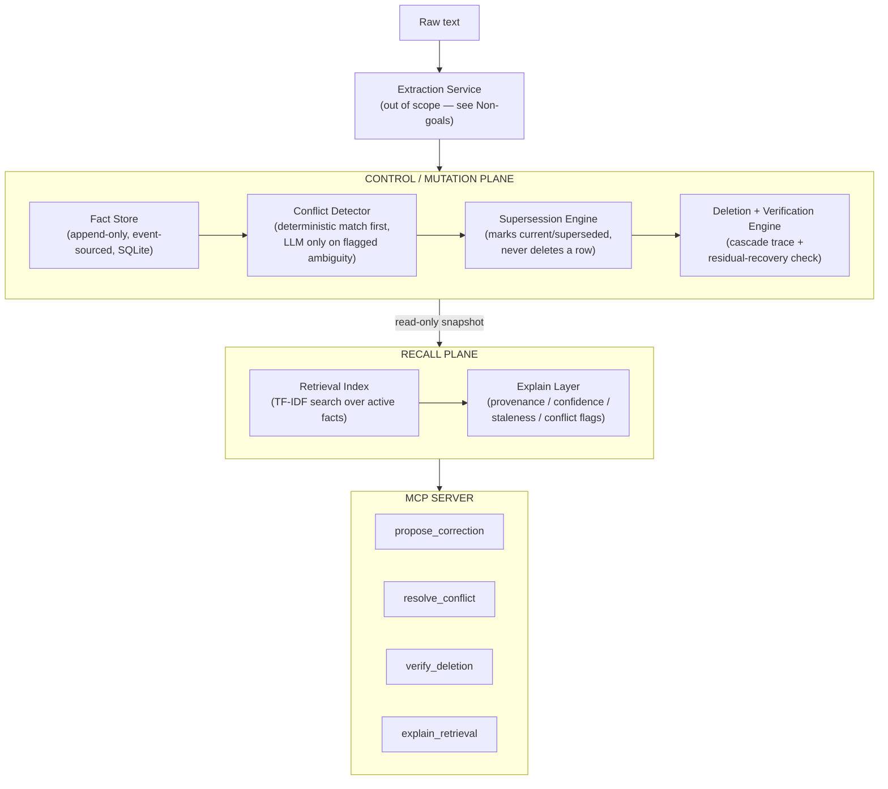

# Minimi Trust Layer

An MCP-native memory trust/correction system: conflict resolution, supersession, and verified deletion for ambient/agentic memory stores.

## The problem

Ambient memory systems fail at two specific, evidenced points:

1. They don't reliably detect or resolve when a newly-captured fact contradicts an older one — and when they do resolve it, they tend to silently overwrite rather than preserve the superseded fact with a record of why it changed.
2. When asked to forget something, they delete the primary record but leave it recoverable through correlated or derived representations, and report success anyway.

This project builds a small, standalone system that does both correctly, proves it with real measurement, and exposes the result through MCP.

**Not a Minimi replacement, not a general RAG app, not a memory dashboard.** No UI. Single-user, single-node, local-first. Nothing here depends on Minimi's private code or schema — this system is evaluated only against its own datasets.

## Architecture



**Governing principle:** two planes, one direction of dependency. The recall plane may *read* the control plane's current state; it never writes to it. All mutation happens only in the control plane, only through the four MCP tools, and every mutation is logged to an append-only event log.

## MCP tools

| Tool | What it does | Mutates? |
|---|---|---|
| `resolve_conflict(subject, predicate)` | Deterministic timestamp logic (M2) → semantic candidate matching (M3) → targeted LLM arbitration only if still ambiguous (M4). Returns the winning fact, full version history, resolution method, and `unresolved: true` rather than a forced guess. | Writes a supersession record only when a real resolution occurs. |
| `propose_correction(target_fact_id, proposed_object, rationale)` | Creates a pending correction proposal. | Writes only the proposal record — never touches the target fact. |
| `verify_deletion(target_fact_id)` | Redacts the primary record, traces derived artifacts this system actually tracks, reports a measured residual-recoverability score. `deletion_incomplete` and `residual_risk_found` are valid outcomes, not bugs. | Redacts the target fact; neutralizes trackable derived artifacts. |
| `explain_retrieval(query, top_k=5)` | TF-IDF search over active facts, annotated with provenance, confidence, staleness, and unresolved-conflict flags. | Never mutates. |

### MCP usage example

Calling `resolve_conflict` against the seeded demo data (an official HR memo vs. an admitted rumor, same timestamp):

```json
// request
{"subject": "office_relocation_date", "predicate": "is"}

// actual observed response
{
  "subject": "office_relocation_date",
  "predicate": "is",
  "unresolved": true,
  "winning_object": null,
  "resolution_method": "unresolved",
  "escalated_to_llm": true,
  "version_history": [ /* both facts, neither marked superseded */ ]
}
```

This is a real, measured result, not an illustrative one — the LLM arbitration step was escalated to and still returned "unresolved" even after a prompt revision explicitly instructing it to weigh confidence/hedging signals. See [Known Limitations](#known-limitations).

## Baselines (§6)

1. **Naive overwrite** — last-write-wins, no conflict detection. The presumed default of a flat vector-store system.
2. **Pure LLM-mediated resolution** — ask the LLM directly, no deterministic scaffolding.
3. **Pure deterministic (timestamp-only)** — newest `observed_at` always wins, no semantic matching, no ambiguity detection.
4. **Naive delete** — remove the row by ID, no cascade trace, report success unconditionally.

## Evaluation results

**Data labeling (§5), enforced throughout:** every scenario in this project's datasets is `SELF-AUTHORED EVALUATION DATA` — hand-built, ground-truth-labeled test cases. No claim is made about Minimi's actual data.

**Track 1 (MemoryAgentBench) was never executed in this build.** Stated here plainly rather than omitted: the raw benchmark was cloned locally (`data/track1_memoryagentbench/_raw`, gitignored) but the reformat into this project's scenario shape was never done. Every result below is Track 2 (self-authored) only.

All numbers below are from a single unified run (`run_all.py`) on the current 11-scenario conflict set and 6-scenario deletion set — every approach measured fresh, on the same dataset, in the same pass, so they are directly comparable to each other.

### Conflict track (11 self-authored scenarios)

| Approach | Accuracy | Notes |
|---|---|---|
| Baseline 1 — naive overwrite | 6/11 (54.5%) | Fails specifically on the backfilled-fact case it was designed to expose |
| Baseline 3 — pure deterministic | 8/11 (72.7%) | Forces a guess on every tie; happens to guess right on one same-timestamp tie purely due to list order |
| Baseline 2 — pure LLM | 2/11 (18.2%) | No deterministic scaffolding — defaults to "unresolved" on nearly everything |
| M2 — deterministic conflict detection | 8/11 (72.7%) | Same total as baseline 3, different reason: correctly refuses a real tie (baseline forced it right by luck) while fixing a different genuine tie baseline forced wrong |
| M3 — semantic candidate matching | 9/11 (81.8%) | Fixes the cross-phrased-subject case M2 structurally can't see |
| M4 — targeted LLM arbitration | 9/11 (81.8%), escalation rate 2/11 (18.2%) | Escalated exactly the 2 flagged-ambiguous cases; correctly stayed unresolved on the genuine tie, still couldn't resolve the memo-vs-rumor case even with a revised prompt |

### Deletion track (6 self-authored scenarios)

| Approach | Accuracy |
|---|---|
| Baseline 4 — naive delete | 2/6 (33.3%) |
| M5 — deletion + cascade verification | 6/6 (100.0%) |

## Known limitations

Stated explicitly, per this project's own rule that no result appears without being measured and no gap is glossed over:

- **Object-value paraphrase is not detected (`t2_007`).** M3's semantic matching compares *subject/predicate* text, never *object values* — two facts phrased differently that might genuinely conflict ("moved to next Friday" vs. a specific date) are invisible to the whole pipeline unless their keys already match. Confirmed wrong at every milestone from M2 through M4. This needs a new mechanism (object-level consistency checking), not a tuning fix.
- **LLM arbitration didn't help on `t2_011`, confirmed on re-measurement after a prompt revision.** The case was designed to reward weighing confidence/hedging signals (0.9-confidence official memo vs. 0.4-confidence admitted rumor). A prompt explicitly instructing the model to weigh those signals still produced "unresolved" on this run. A real, disclosed limitation of the specific free-tier/auto-routed model used, not investigated further within this project's scope.
- **A same-timestamp tie can be "won" by baseline 3 purely by list order, not real logic.** `t2_011`'s pure-deterministic "correct" result is an artifact of Python's tie-breaking behavior on equal timestamps, not evidence the baseline actually resolves ties — worth knowing when reading the table above at a glance.
- **Deletion verification can only trace what this system itself recorded.** `embedding_index`/`index_entry` artifacts are detected but not purgeable by design — this matches MemLeak's documented finding about real production systems, not a shortcut taken here.
- **Concurrency correctness is scoped to a single process/store instance**, per this project's own single-node assumption (§1). Two separate OS processes sharing one SQLite file is out of scope.
- **Small dataset (11 conflict scenarios, 6 deletion scenarios).** Percentage deltas at this scale are directional evidence that each mechanism does what it's supposed to (verified per-scenario, not just in aggregate) — not a statistically robust claim.
- **Track 1 (MemoryAgentBench) was never executed** — the largest single scope gap in this build, disclosed here rather than omitted.

## Reproducibility

```powershell
git clone <this repo>
cd minimi-trust-layer
python -m venv .venv
.\.venv\Scripts\Activate.ps1
pip install -e ".[dev,llm,mcp]"

# Full regression suite
pytest -q

# The single, current, apples-to-apples evaluation run behind the table above
$env:OPENROUTER_API_KEY = "sk-or-v1-..."
python -m minimi_trust.eval.run_all

# Run the MCP server itself (for a live client like Claude Desktop)
python -m minimi_trust.mcp_server.server
```

## Repository structure

src/minimi_trust/
├── schemas.py                  # Fact/Source/Proposal/Deletion data model (M0)
├── store/
│   └── fact_store.py            # Append-only, event-sourced Fact Store (M2, thread-safe M6/M7)
├── conflict/                    # Deterministic (M2), semantic (M3), LLM arbitration (M4)
├── deletion/                    # Deletion + cascade verification engine (M5)
├── recall/                      # TF-IDF retrieval + Explain layer (M6)
├── mcp_server/                  # The four MCP tools (M6)
├── eval/                        # Baselines, per-milestone runners, unified run_all.py (M8)
├── data/
│   └── track2_self_authored/    # Hand-built, labeled evaluation scenarios (§5)
└── tests/                       # One regression suite per milestone, plus M7 hardening tests
